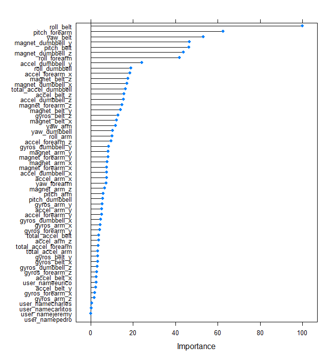
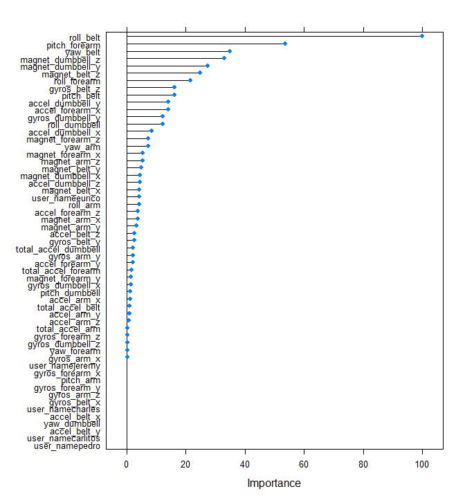
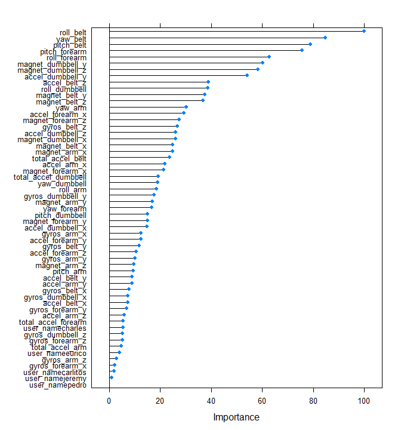

# Fitness Device Weight Lifiting Measurements
Drew McWilliams  
November 26, 2016  


## Overview

Fitness devices, such as Jawbone Up, Nike FuelBand, and Fitbit collect a large quantity of data on the movements of those who wear them.  For this study we have data for six individulas who were asked to perform barbell lifts in five different manners.  The desired outcome is to train a predictive model that will be able to use similar predictor variables in order to determine the manner in which the exercise was performed.


## Source Data
Two data sources have been provided for this project, one for model training, the other for testing.  The data for this project come from this source: http://groupware.les.inf.puc-rio.br/har and the data sets are accessible via the following urls:

Training Data:
https://d396qusza40orc.cloudfront.net/predmachlearn/pml-training.csv

Test Data:
https://d396qusza40orc.cloudfront.net/predmachlearn/pml-testing.csv

The final selected model will be used to predict the manner in which the exercise was performed in the test data.  The test data set is comprised of 20 observations that do not include the classe variable, indicative of how the barbell lifts were carried out.


```r
library(caret)
library(randomForest)
library(Hmisc)
library(rpart)
library(ipred)
```


```r
set.seed(1123)
    trainurl="https://d396qusza40orc.cloudfront.net/predmachlearn/pml-training.csv"
    testurl="https://d396qusza40orc.cloudfront.net/predmachlearn/pml-testing.csv"
#download and populate testing and training dataframes
    
    df_train<-read.csv(trainurl, header=T)
    df_test<-read.csv(testurl, header=T)
```

##Preparing the Data

```r
#Size of the training set
dim(df_train)
```

```
## [1] 19622   160
```
The number of possible predictors is quite large, so I want to eliminate any extraneous column to reduce the chance of over training.  The first thing that I wanted to was to idenify and remove any columns that had a single unique value, and thus would be of little value.  With a very quick exploration of the data, I noticed many columns that were missing a majority of their values, so I eliminated these as well.  

With some initial model building I found a few others columns that led to overfitting.  These were any timestamp fields, as well as that fields, "X" and "num_window".  These were also removed from the training set.

```r
# clean up training - remove low varaiance and predominantly NA columns

    zVarcols<-colnames(df_train)[nearZeroVar(df_train)]
    naCols<-colnames(df_train)[colSums(is.na(df_train)) > nrow(df_train)*.5]
    time_cols<-colnames(df_train)[grepl("*time*", colnames(df_train))]
    rm_cols<-c(zVarcols,naCols,time_cols,"X","num_window")
    train_upd<-df_train[,!names(df_train) %in% rm_cols]
```

My resulting training data set was comprised of 54 variables, reducing the number of possible predictors by 106:


```r
dim(train_upd)
```

```
## [1] 19622    54
```

##Building the Models
With my remaining training set, I partitioned this into training and testing sets, with sixty percent allocated to training.  I also set a cross validation control at 3 that was used by all of the models that I built.


```r
# create training and testing partitions of training data
    inTrain<- createDataPartition(y=train_upd$classe, p=.6, list =F)
    Part_train<-train_upd[inTrain,]
    Part_test<-train_upd[-inTrain,]
#Model Cross-Validation setting
    cv_set<-trainControl(method="cv", number=3, verboseIter=F)
```
I decided to try three different model methods to see which would have the best results.  For this exercise, I tried Random Forests, Gradient Boosting, and Bagged Classification and Regression method. The one with the lowest out of sample error will be used as to predict the outcome of the test set.

I built the three models, using the cross-valitation mentioned above, and stored the preditions to compare to the actual results.


```r
#model builds
    mod_rf<-train(classe~., method="rf", data=Part_train, trControl=cv_set)
    mod_gbm<-train(classe~., method="gbm", data=Part_train, trControl=cv_set, verbose=FALSE)
    mod_trbag<-train(classe~., method="treebag", data=Part_train, trConrol=cv_set)
#generate predictions    
    pred_rf<-predict(mod_rf, Part_test)
    pred_gbm<-predict(mod_gbm, Part_test)
    pred_trbag<-predict(mod_trbag, Part_test)
```

## Model Review and Selection
**Random Forest**
The Random Forest method had very encouraging results.  The accuracy of this model was 99.3%, resuling in an out of sample error of .007.  The model took the longest processing time to build, but the resulting confusion matrix displays how few of the classe variable were actually missed.


```r
confusionMatrix(pred_rf, Part_test$classe)
```

```
## Confusion Matrix and Statistics
## 
##           Reference
## Prediction    A    B    C    D    E
##          A 2231   15    0    0    0
##          B    0 1501    7    1    0
##          C    0    2 1357   16    1
##          D    0    0    4 1267    6
##          E    1    0    0    2 1435
## 
## Overall Statistics
##                                           
##                Accuracy : 0.993           
##                  95% CI : (0.9909, 0.9947)
##     No Information Rate : 0.2845          
##     P-Value [Acc > NIR] : < 2.2e-16       
##                                           
##                   Kappa : 0.9911          
##  Mcnemar's Test P-Value : NA              
## 
## Statistics by Class:
## 
##                      Class: A Class: B Class: C Class: D Class: E
## Sensitivity            0.9996   0.9888   0.9920   0.9852   0.9951
## Specificity            0.9973   0.9987   0.9971   0.9985   0.9995
## Pos Pred Value         0.9933   0.9947   0.9862   0.9922   0.9979
## Neg Pred Value         0.9998   0.9973   0.9983   0.9971   0.9989
## Prevalence             0.2845   0.1935   0.1744   0.1639   0.1838
## Detection Rate         0.2843   0.1913   0.1730   0.1615   0.1829
## Detection Prevalence   0.2863   0.1923   0.1754   0.1628   0.1833
## Balanced Accuracy      0.9984   0.9938   0.9945   0.9919   0.9973
```
Training of the model resulting in the weighting of the variables in the importance illustrated below


```r
plot(varImp(mod_rf))
```



**Gradiant Boosting**
The accuracy rate of the model built using Gradiant Boosting dropped a bit from that of the Random Forest.  The out of sample error was slightly higher, at .041.  With an overall accuracy 95.9%, this would still be a fairly reliable model.


```r
confusionMatrix(pred_gbm, Part_test$classe)
```

```
## Confusion Matrix and Statistics
## 
##           Reference
## Prediction    A    B    C    D    E
##          A 2200   60    0    0    4
##          B   20 1407   36    6   14
##          C    7   43 1316   51   11
##          D    5    6   12 1219   31
##          E    0    2    4   10 1382
## 
## Overall Statistics
##                                           
##                Accuracy : 0.959           
##                  95% CI : (0.9543, 0.9632)
##     No Information Rate : 0.2845          
##     P-Value [Acc > NIR] : < 2.2e-16       
##                                           
##                   Kappa : 0.9481          
##  Mcnemar's Test P-Value : 9.056e-14       
## 
## Statistics by Class:
## 
##                      Class: A Class: B Class: C Class: D Class: E
## Sensitivity            0.9857   0.9269   0.9620   0.9479   0.9584
## Specificity            0.9886   0.9880   0.9827   0.9918   0.9975
## Pos Pred Value         0.9717   0.9488   0.9216   0.9576   0.9886
## Neg Pred Value         0.9943   0.9826   0.9919   0.9898   0.9907
## Prevalence             0.2845   0.1935   0.1744   0.1639   0.1838
## Detection Rate         0.2804   0.1793   0.1677   0.1554   0.1761
## Detection Prevalence   0.2886   0.1890   0.1820   0.1622   0.1782
## Balanced Accuracy      0.9871   0.9574   0.9723   0.9698   0.9779
```

In the plot below, we can see that many of the variables have been dropped from consideration as compared to what was seen with the Random Forest.  We infer that this results in the lower accuracy.


```r
plot(varImp(mod_gbm))
```




**Bagged Classification and Regression**
With an accuracy of 98.34%, this model was a close second to the Random Forest model.  The out of sample error rate would be .0166.


```r
confusionMatrix(pred_trbag, Part_test$classe)
```

```
## Confusion Matrix and Statistics
## 
##           Reference
## Prediction    A    B    C    D    E
##          A 2224   20    2    5    2
##          B    4 1472   11    3    5
##          C    2   20 1345   20    3
##          D    1    3    8 1251    8
##          E    1    3    2    7 1424
## 
## Overall Statistics
##                                           
##                Accuracy : 0.9834          
##                  95% CI : (0.9804, 0.9861)
##     No Information Rate : 0.2845          
##     P-Value [Acc > NIR] : < 2e-16         
##                                           
##                   Kappa : 0.979           
##  Mcnemar's Test P-Value : 0.01417         
## 
## Statistics by Class:
## 
##                      Class: A Class: B Class: C Class: D Class: E
## Sensitivity            0.9964   0.9697   0.9832   0.9728   0.9875
## Specificity            0.9948   0.9964   0.9931   0.9970   0.9980
## Pos Pred Value         0.9871   0.9846   0.9676   0.9843   0.9910
## Neg Pred Value         0.9986   0.9928   0.9964   0.9947   0.9972
## Prevalence             0.2845   0.1935   0.1744   0.1639   0.1838
## Detection Rate         0.2835   0.1876   0.1714   0.1594   0.1815
## Detection Prevalence   0.2872   0.1905   0.1772   0.1620   0.1832
## Balanced Accuracy      0.9956   0.9830   0.9881   0.9849   0.9927
```
A review of the variables that it used, one can see that the weighting is quite similar to that of the Random Forest.  It also is using many more variables that the Gradiant Boosting Model neglected.

```r
plot(varImp(mod_trbag))
```



#Conclusion
The Random Forest Model was selected to predict the outcome on our initial test set.  I retrained the model, to include the entire testing set and run the predictions.


```r
#model retain
    mod_rf_final<-train(classe~., method="rf", data=train_upd, trControl=cv_set)
```

The result:

```r
predict(mod_rf_final,df_test)
```

```
##  [1] B A B A A E D B A A B C B A E E A B B B
## Levels: A B C D E
```


